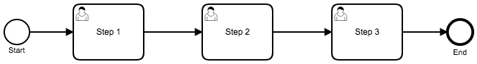
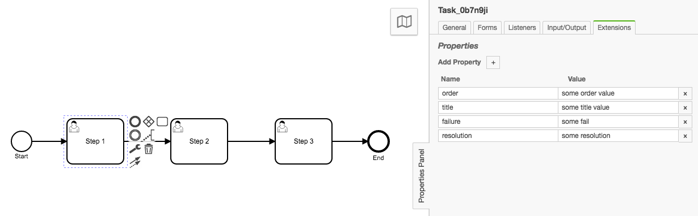

# Camunda BPMN Model API to Freemarker Template

This is a use case example of using the CamundaBPM (Camunda.org) Model API with Vertx.
Allows you to provide a BPMN file which will be read and parsed by Camunda's Java Model API and then rendered through a provided FreeMarker template.

## Still not sure what this does...

This lets you provide a FreeMarker template and a BPMN file; the output is a rendered template.  The purpose is to allow someone to navigate the Camunda BPMN model API directly in the FreeMarker template in order to easily generate documentation for BPMN files.

# Setup

Install NPM Dependencies: `./gradlew clean npmInstall`

Run Gradle Build: `./gradlew clean run`

# References

1. https://docs.camunda.org/javadoc/camunda-bpm-platform/7.8/?org/camunda/bpm/model/bpmn/instance/package-summary.html
1. User Tasks Model Element: https://docs.camunda.org/javadoc/camunda-bpm-platform/7.8/org/camunda/bpm/model/bpmn/instance/UserTask.html


# BPMN





## BPMN File XML Snippet

```xml
...
    <bpmn:userTask id="Task_0w364uq" name="Step 3" camunda:assignee="chris">
      <bpmn:extensionElements>
        <camunda:properties>
          <camunda:property name="order" value="My Order" />
          <camunda:property name="title" value="My Title" />
          <camunda:property name="failure" value="My Failure" />
          <camunda:property name="resolution" value="My Resolution" />
        </camunda:properties>
      </bpmn:extensionElements>
      <bpmn:incoming>SequenceFlow_0adri7o</bpmn:incoming>
      <bpmn:outgoing>SequenceFlow_15kfmnc</bpmn:outgoing>
    </bpmn:userTask>
...
```


# FreeMarker Template

Example:

```freemarker
<#list tasks_>
Elements:
  <#items as task>
  Task Type:
  ${task.getElementType().getTypeName()}

  Task Name:
  ${task.getName()}

  Custom Attributes:
  <#list task.getExtensionElements().getElementsQuery().filterByType(extensionElements_).singleResult().getCamundaProperties()>
    <#items as extensionElement>
      Attribute:
      Key: ${extensionElement.getCamundaName()}
      Value: ${extensionElement.getCamundaValue()}

    </#items>
  </#list>
--------------------

  </#items>
</#list>
```

# Config File

The template_inputs property is inserted into freemarker.  Any property with a underscore `_` at the end of the property name will go through `eval()`

```js
...
{
  "template_inputs": {
    "extensionElements_": "instanceClass('camunda.CamundaProperties')",
    "tasks_": "modelInstance.getModelElementsByType(instanceClass('Task'))"
  },
  "template_path": "myTemplate.ftl"
}
...
```

The `extensionElements_` property is a special property that provides the CamundaProperties Class for use in the FreeMarker template such as:

```freemarker
<#list task.getExtensionElements().getElementsQuery().filterByType(extensionElements_).singleResult().getCamundaProperties()>
```


# Console Output

```console
Elements:
  Task Type:
  userTask

  Task Name:
  Step 1

  Custom Attributes:
      Attribute:
      Key: order
      Value: some order value

      Attribute:
      Key: title
      Value: some title value

      Attribute:
      Key: failure
      Value: some fail

      Attribute:
      Key: resolution
      Value: some resolution

--------------------

  Task Type:
  userTask

  Task Name:
  Step 2

  Custom Attributes:
      Attribute:
      Key: order
      Value: order123

      Attribute:
      Key: title
      Value: title321

      Attribute:
      Key: failure
      Value: fail000

      Attribute:
      Key: resolution
      Value: resABC

--------------------

  Task Type:
  userTask

  Task Name:
  Step 3

  Custom Attributes:
      Attribute:
      Key: order
      Value: My Order

      Attribute:
      Key: title
      Value: My Title

      Attribute:
      Key: failure
      Value: My Failure

      Attribute:
      Key: resolution
      Value: My Resolution

--------------------
```

# TODO / Enhancements:

1. <s>Provide external / injectable `input` object as a json file.</s>
1. <s>Config/Input defines the Template</s>
1. Provide a File Writer
1. Add more generation get Elements call so that all elements are gotten and the FreeMarker template will sub-navigate the tree of elements. (Removes the current need to setup "Per Element Type" properties in the `inputs` object)
1. Provide a HTTP endpoint to get the rendered template as different content types such as JSON and HTML
1. Provide a HTTP Endpoint to inject Config and FTL templates so the parser can live as a "microservice"
1. Generate Image of BPMN file
1. Generate Zoomed in Image of BPMN Element in context of overall file


